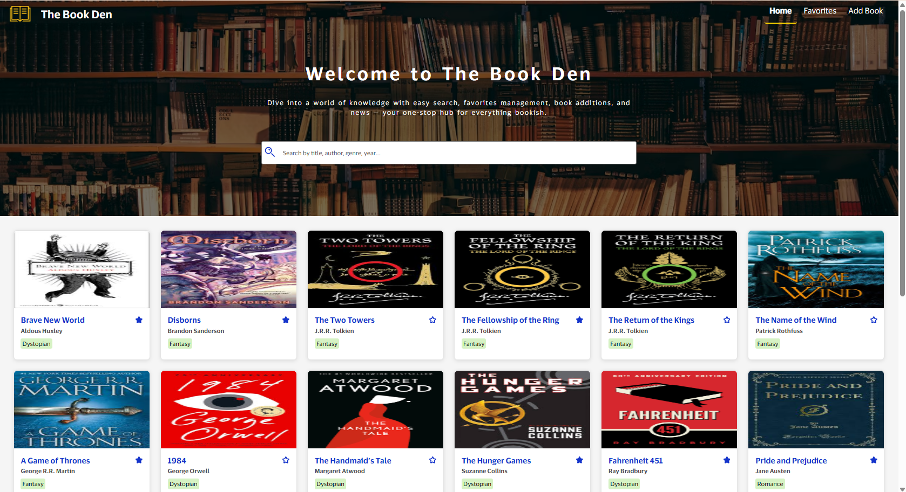
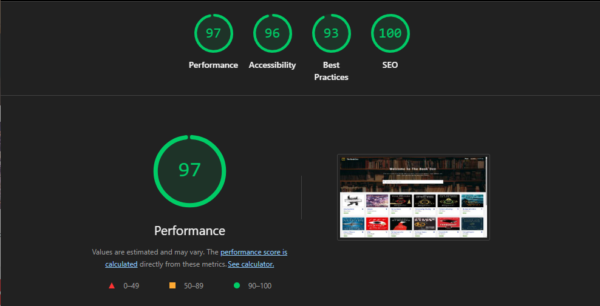

# Book Library Application

A modern, full-stack web application for managing a personal book collection. This project allows users to **browse**, **search**, **manage**, and **favorite** books.

---

## Features

- **Book Catalog:** Infinite loading on scroll displaying books sorted by latest modified or added, with newest entries appearing at the top.  
- **Search:** Search books by title, author, published year, or genre.  
- **Add/Edit/Delete Books:** Full CRUD functionality allowing users to add new books, edit existing book details, and delete books from the collection. Cover images can be uploaded.  
- **Favorite Books:** Mark or unmark books as favorites for quick access.  
- **Responsive UI:** A clean and accessible design optimized for desktop and mobile devices.  
- **Image Handling:** Efficient in-memory caching for book cover images.  
- **Security:** Implements best practices including Content Security Policy (CSP), HSTS, clickjacking protection, and origin isolation headers.  
- **Robust Backend:** Built with Express.js, using JSON file storage for simplicity and fast prototyping.  
- **Accessibility:** Accessibility is given highest priority throughout the application.  
- **Error Handling:** Comprehensive error handling implemented in both frontend and backend.  
- **Testing:** Unit tests added for both frontend and backend.

---

## Technologies Used

- **Frontend:** React, TypeScript, Zustand  
- **Backend:** Node.js, Express, Multer (file uploads), Sharp (image processing)  
- **Caching:** In-memory caching for image assets (NodeCache)  
- **Security:** CSP, HSTS, COOP, X-Frame-Options headers  
- **Others:** ESLint, Prettier, Git for version control  

## Screenshots

### Frontend Landing Page

### Performance Metrics (Lighthouse)

---

## Getting Started

### Prerequisites

- Node.js (>=14.x)  
- npm or yarn  

### Installation

git clone https://github.com/RojaChekuri/BookDen.git

# Install frontend dependencies
cd library-frontend
npm install

# Install backend dependencies
cd library-backend
npm install

### Running the Application

# Start backend server
cd library-backend
npm start

# Start frontend app (in new terminal)
cd library-frontend
npm start

Backend runs on http://localhost:4000
Frontend runs on http://localhost:3000

# Future Improvements
-Implement user authentication and personalized libraries
-Migrate to a database for scalability (e.g., MongoDB or PostgreSQL)
-Add advanced filtering and sorting options
-Enhance image delivery with CDN and automatic resizing

# License
MIT License © [Roja Chekuri]
